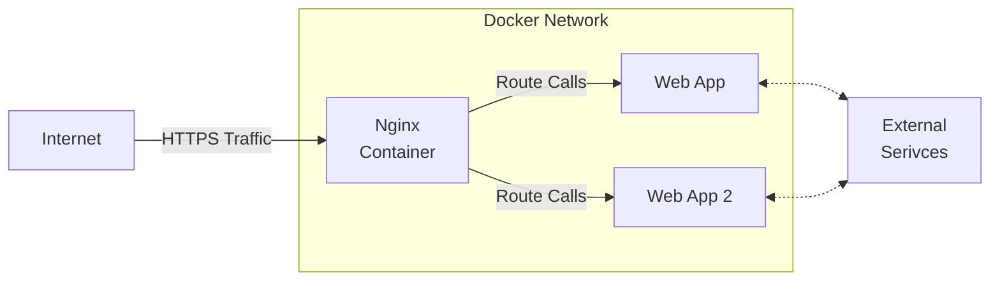

# First Pi Web App

## High Level Architecture

This project attempts to achieve the set up discribe below by the mermaid chart.  

If the above chart doesn't render use: [mermaid editor](https://mermaid.live/) to view.

## Set Up Explained

- [Deployment Process](./docs/DEPLOYMENT_PROCESS.md)
- [Exposing Web App in the Pi](./docs/EXPOSE_WEB_APP.md)
- [Attaching Domain to Pi](./docs/)

## Concepts

Below is a list of concepts I came across to achieve the set-up.

- [SSH via TailScale Tunneling](..)
- [Cloudflare Tunneling]
- [Attaching Domain]
