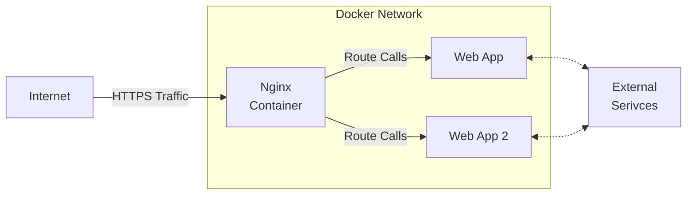

# First Pi Web App

## High Level Architecture

This project attempts to achieve the set up discribe below by the mermaid chart.  

If the above chart doesn't render use: [mermaid editor](https://mermaid.live/) to view.

## Set Up Explained
