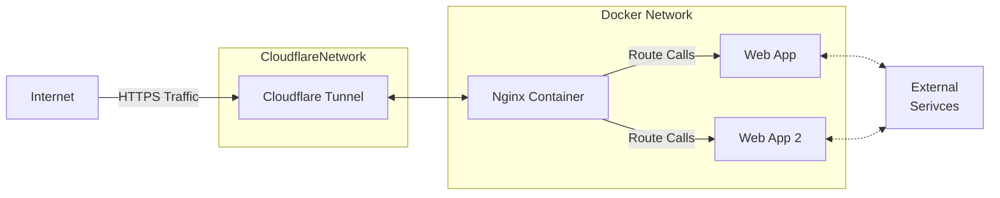

# First Pi Web App

## High Level Architecture

This project attempts to achieve the set up discribe below by the mermaid chart.  

Visit the site [khutso test site](https://khutso-test-site.online/app). Might be up or down I don't have my Pi up all the time and I don't itend to electricity is expensive in South Africa lol.

If the above chart doesn't render use: [mermaid editor](https://mermaid.live/) to view.

## Set Up Explained

- [Deployment Process](./docs/DEPLOYMENT_PROCESS.md)
- [Exposing Web App in the Pi](./docs/EXPOSE_WEB_APP.md)

## Issues I came across

To see the challenge I came across and what I did to overcome them if I was able please see belwo:

- [Issues Encounted](./docs/ISSUES_ENCOUNTED.md)

## Concepts

Below is a list of concepts I came across to achieve the set-up.  

- Port forwarding
- VPN Tunneling with TailScale
- Public web tunneling with cloudflare.
- SCP (I knew SSH only)
- Domain Name System (DNS System) [I know I said System twice]
- Public vs Private Network.
