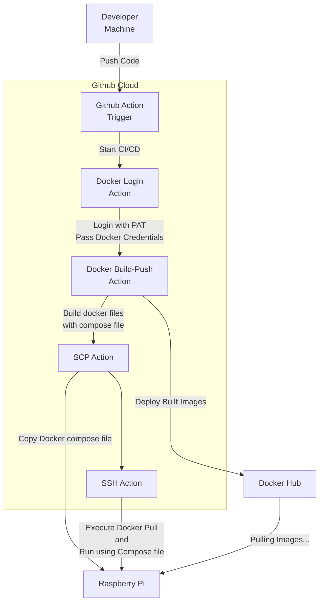

# Deployment Process

This document explains how I was able to take my source code from GitHub to Pi and run it there.

## Development to Deployment Overview



Please use [mermaid](https://mermaid.live/) to view the diagram if your read me rendered doesn't support it.

## Explanation

The Digram tries to summarize the flow of getting code committed and then deployed to Rasberry Pi, here I will have a somewhat detailed step by step guide of what I have done in the [Github Action](../.github/workflows/github-actions-demo.yml) file.  

### Steps

1. The Github Action has a trigger to run the pipeline whenever I commit code to main

    ```yml  
    on: 
        push:
            branches: [ main ]
    ```

2. The first real step is for my action to login into Dockerhub using the docker action, which needs my `PAT (Personal Access Token)`, this so that Docker can identify the agent running the pipeline and the access token should have enough permissions to push built images to some docker repository for me it was my personal one: [`khutsokobela`](https://hub.docker.com/u/khutsokobela)

    ```yml
    # Login to DockerHub to be used by build/deploy
    - name: Log into DockerHub
      uses: docker/login-action@v3
      with:
        username: ${{ secrets.DOCKER_USERNAME }}
        password: ${{ secrets.DOCKER_PAT_TOKEN }}

    # Build and Deploy docker file to registry:
    # https://hub.docker.com/u/khutsokobela
    -name: Build and Push Web App Dockerfile
     uses: docker/build-push-action@v6
     with:
        context: ${{ github.workspace }}/src/webapp
        file: ${{ github.workspace }}/src/webapp/Dockerfile
        push: true
        tags: khutsokobela/piweb:latest
        # The Rasberry Pi 5 uses arm64 CPU arch
        # The GH Agents use amd64 so
        # I built images to be amd64 and arm64
        # This allows the images to run on any CPU architecture
        platforms: linux/amd64,linux/arm64 #multi arch support
    ```

3. After the are images deployed we need to do two things copy the docker compose and run the file to pull and build images.

4. To do this we can use `SCP (Secure Copy)` and `SSH (Secure Shell)`. SCP allows us to securely copy files from one machine to another and SSH allows us to securely open a terminal a remote machine.

5. So we need to use SCP to copy the Docker Compose [file](../src/docker-compose.yml) then SSH to run commands:

    ```sh
    # pull images specified in compose file
    docker compose -f docker-compose.yml pull

    # run images in detached mode
    docker compose -f docker-compose.yml up -d

    # remove unused images (old tags)
    docker image prune -f
    ```

6. To Securely use SSH and SCP I need two things, a user name of the user I will be `SSH-ing` or `SCP-ing` into the machine as and the IP or Hostname of the machine I want to SSH into.

7. Please see the [issues](./ISSUES_ENCOUNTED.md#ssh-scp-connection-issue) I encounted when trying to SSH due to my Internet Service Provider not allowing Port Forwarding.

8. As discussed above I needed to use [Tailscale](https://tailscale.com) to have peer-to-peer connection between GH Agent and my Pi. The GH Action Agent needed to authenticate against Tailscale so it can be allowed in the private network that exposes the Pi, the step looks like this:

    ```yml
    - name: Tailscale Authentication
      uses: tailscale/github-action@v4
      with:
        oauth-client-id: ${{ secrets.TS_OAUTH_CLIENT_ID }}
        oauth-secret: ${{ secrets.TS_OAUTH_CLIENT_SECRET }}
        tags: tag:github-pi-action
    ```

9. The SCP and SSH was easy once I solved my connection issues with these simple actions from appleboy:

    ```yml
    - name: Copy Compose file to Pi
      uses: appleboy/scp-action@v1
      with:
        host: ${{ secrets.SSH_HOST }}
        username: ${{ secrets.SSH_USERNAME }}
        key: ${{ secrets.SSH_PRIVATE_KEY }}
        source: "src/docker-compose.yml"
        target: "~/pi-web/"

    - name: Deploy Compose file to Pi
      uses: appleboy/ssh-action@v1.0.0
      with:
        host: ${{ secrets.SSH_HOST }}
        username: ${{ secrets.SSH_USERNAME }}
        key: ${{ secrets.SSH_PRIVATE_KEY }}
        script: |
            cd ~/pi-web/src
            ls -la
            docker compose -f docker-compose.yml pull
            docker compose -f docker-compose.yml up -d
            docker image prune -f
    ```

With all the above steps I was able to deploy my code and also have it run in my Pi.  

## What To Checkout

- [How I exposed my Pi to the public Internet](./EXPOSE_WEB_APP.md)
