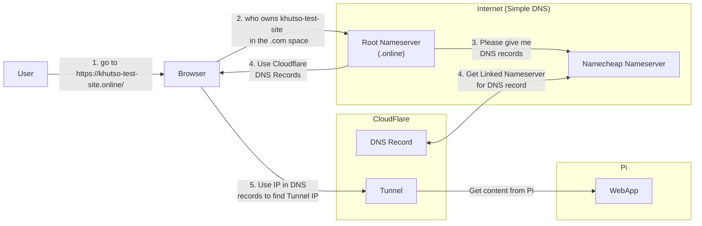

# EXPOSE WEB APP in the Pi

Things I needed to expose my web app to the internet from my Pi after deployment.

- Domain name that can be reached from a browser
- Expose a port from my Pi to the internet for inbound http traffic.

## Buying A Domain Name

For my web app to have the domain: [khutso test site](https://khutso-test-site.online/) I bought it from [name cheap](www.namecheap.com).  
I will try ultimate best to try and remember how domains work so I can explain why I needed to buy a domain.

### Why Buy A Domain

So whenever you visit a website like google.com that url is pointing to some IP of some server but that's part of the whole story.  

The networking concept that allows computers to find IPs is known as the DNS (Domain Name System) and there's an organisation that takes care of all records of all domain names in the world, well the `Top Level Domains (TLDs)` at least. TLDs are the `.com`, `.co.uk`, `.dev` etc in the domain name.  

The reason you can't just create your own domain is that there's steps that are regulated that are responsible for making sure your domain name is linked to an IP and companies like `name cheap` are what we call `registrars`, they are authorised to issue domain names.  

The diagram below tries to explan how the whole things works (of course not too detailed):

The steps of what happens above are as follows:

1. A user types my website's domain name
2. The browser then sees my web site ends with `.online`
3. It goes to the root nameserver that keeps records of registrars who have `.online` domains.
4. It finds out that name cheap, where I bought my domain, is the place where this name lives.
5. It then asks for DNS Records.
    - Name cheap has it's own default name servers for keeping DNS records of domains created in the site.
    - I updated mine to point to cloudflare DNS Name Servers since I wanted traffic to my domain to go through the cloudflare tunnel.
6. In Cloudflare I linked my domain name with my Pi's tunnel IP.
7. In the DNS Records that the browser will get it will have the IP of Cloudflare Tunnel which forward traffic to my Pi.

### Why Use Cloudflare Tunnel and What Is It

In my implementation of self hosting I found an issue that was kinda annoying which was that my ISP doesn't allow port forwarding.  

So I have to find ways to let in bound traffic into my Pi. I have explained how I overcame this issue for [deployments into the Pi using TailScale](./ISSUES_ENCOUNTED.md#3-tunneling-with-tailscale)  

Cloudflare Tunnels solve the same problem but they are more focused for web hosting wereas tailscale is focused on VPNs (peer-to-peer) communication, so it made sense to use TS on my pipeline only and CF for exposing the web app.  

Please Cloudflare [docs](https://developers.cloudflare.com/cloudflare-one/networks/connectors/cloudflare-tunnel/) for how tunneling works they do a better job than me.
