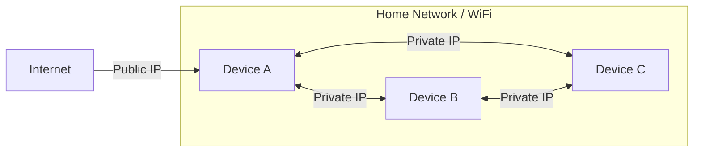
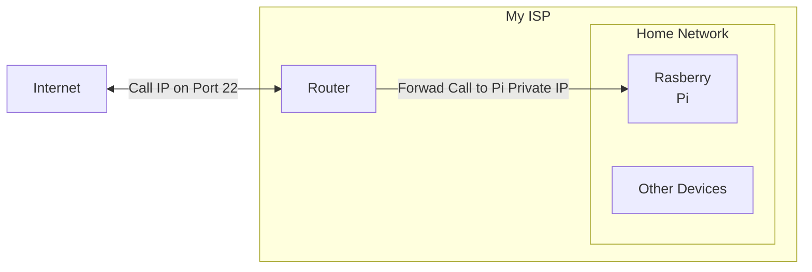
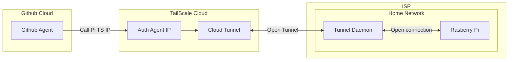

# Issues Encounted

This file documents the issues I came across and workarounds when trying to expose a web app using my Pi.

## SSH SCP Connection Issue

When the Github Action agent that was running my pipeline needed to SSH or SCP into my Pi it kept getting timeout errors.  
This is because the GitHub Agent couldn't reach my Pi's hostname at all, below are the reasons.  

### 1 Private vs Public IP

So it turns when devices are connected to the same WiFi / Home network they have a private network.  

This means that devices within the same network can communicate with each other using different IPs than the ones they use when communicating with other devices over the internet.  

At first I was using the Private IP in my GH secret variables which I have been using when testing SSH-ing from my home PC and the Pi which where in fact on the same network.  

But as the diagram aboves show anything outside the network needed a public IP to access my Pi/Device within the network.

### 2 Exposing Public IP Port Forwarding

To expose a public that can be called from the internet I needed a way to let devices from outside my network to call me.  
This meant I need a way to tell my WiFi Router to allow inbound calls (calls from outside world).  

To do this I needed to open a port (SSH uses port 22 by default) then I needed to let my router `forward` any calls to port 22 to my pi.

I use a `ZTE 67EE06` and it does support port forward but the ISP I use doesn't allow in bound calls into home networks so port forwarding wasn't an option.  

To overcome this I needed to have what is reffered to as Tunneling which I will explain in the next section

### 3 Tunneling with TailScale

Tailscale allows me to create a VPN that allows devices to call each other as if they are within the same local network.

Tailscale allows only authenticated devices to call my Pi by installing the agent with an access token that belongs to the VPN.

It does this by installing a Tailnet client (daemon) that will result in my device having a IP that is visible within the Tailscale network and I can add other devices that I want within the network.  

#### How I think It Works

I believe how this works is that my installed daemon will initiate an outgoing HTTP and have a keep-alive that last a looooong time / constantly refreshed.  

This call would be to the Tailscale cloud and any call to my Pi would go through the Tailscale cloud and my ISP won't see it a calls a call from the internet.

#### How It Looks

The diagram aboves explains key details:

- My Github Agent will install a Tailscale daemon then authenticate against my VPN with some access token.

- The Agent's IP will be added in the VPN so it call other devices in the VPN

- My Raspberry Pi will also have a Tunnel daemon that is running and is connected to my VPN cloud.

- So when my GH Agent sends a request (HTTP, SCP, SSH) to the IP that is linked to my Pi it will pass Tailscale cloud first

- Because my Pi already did an outgoing request to Open a Tunnel, Tailscale will just forward that request to Pi.

- My ISP will see this request as a respond to an already open connection, so it doesn't see it as a inbound request.

Just for reference TailScale uses [WireGuard](https://www.wireguard.com/) protocol to achieve this.
