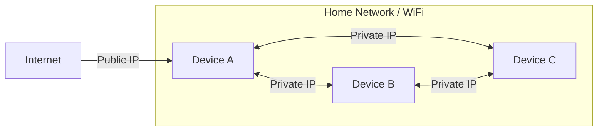

# Issues Encounted

This file documents the issues I came across and workarounds when trying to expose a web app using my Pi.

## SSH SCP Connection Issue

When the Github Action agent that was running my pipeline needed to SSH or SCP into my Pi it kept getting timeout errors.  
This is because the GitHub Agent couldn't reach my Pi's hostname at all, below are the reasons.  

### 1 Private vs Public IP

#### Context

So it turns when devices are connected to the same WiFi / Home network they have a private network.  

This means that devices within the same network can communicate with each other using different IPs than the ones they use when communicating with other devices over the internet.  

At first I was using the Private IP in my GH secret variables which I have been using when testing SSH-ing from my home PC and the Pi which where in fact on the same network.  

But as the diagram aboves show anything outside the network needed a public IP to access my Pi/Device within the network.

#### Exposing Public IP

To expose a public IP I needed a way to tell my router to allow traffic from the outside into my home network, there's a concept that helps with this called `Port Forwarding`.  

Only issue is that my ISP doesn't allow this to happen for whatever reason, so I needed an alternative, and lucky me Tailscale exists!

##### TailScale Overview
